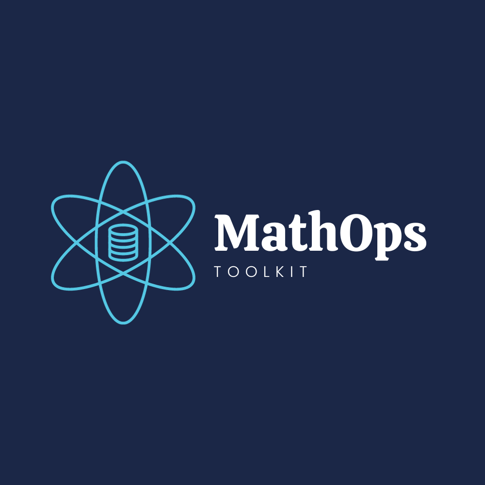

### Open Source Programs
MathOps is ready for HacktoberFest


<br/>
<p align="center">
  <a href="https://github.com/Sparklinstar/MathOps-Toolkit">
    
  </a>

  <h3 align="center">MathOps Toolkit</h3>

  <p align="center">
    Unlock the Power of Math: Building a World of Customized Calculations!
    <br/>
    <br/>
    <a href="https://github.com/Sparklinstar/MathOps-Toolkit"><strong>Explore the docs »</strong></a>
    <br/>
    <br/>
    <a href="https://github.com/Sparklinstar/MathOps-Toolkit">View Demo</a>
    .
    <a href="https://github.com/Sparklinstar/MathOps-Toolkit/issues">Report Bug</a>
    .
    <a href="https://github.com/Sparklinstar/MathOps-Toolkit/issues">Request Feature</a>
  </p>
</p>

     

## Table Of Contents

* [About the Project](#about-the-project)
* [Built With](#built-with)
* [Getting Started](#getting-started)
  * [Prerequisites](#prerequisites)
  * [Installation](#installation)
* [Contributing](#contributing)
* [License](#license)
* [Authors](#authors)
* [Acknowledgements](#acknowledgements)


## About This Project

Welcome to the "MathOps Toolkit: Custom Python Data Types & GUI Calculator" project!

**What is MathOps Toolkit?**

MathOps Toolkit is an open-source initiative designed to make mathematical operations in Python more accessible, efficient, and enjoyable. This project focuses on creating a comprehensive set of custom Python data types tailored for various mathematical tasks. Whether you're working on scientific computing, data analysis, or algorithm development, these custom data types aim to simplify your code and enhance your mathematical workflows.

**What's in the Toolkit?**

My toolkit includes a versatile collection of custom data types, ranging from matrices and complex numbers to statistical distributions and geometric shapes. Each data type is thoughtfully crafted to empower developers like you with the tools needed to tackle mathematical challenges effectively. As part of my Hacktoberfest initiative, I invite you to contribute by implementing missing data types or enhancing existing ones.

**The GUI Calculator Challenge**

In addition to expanding our custom data types, I challenge contributors to build a GUI calculator using the MathOps Toolkit. This calculator will showcase the practical applications of these data types and provide users with an intuitive and visually appealing tool for mathematical calculations. It's an exciting opportunity to explore GUI development in Python and integrate it with your mathematical skills.

**How Can You Contribute?**

I welcome contributions from all Python enthusiasts, whether you're new to open source or an experienced developer. To get started, simply fork this repository, explore the existing data types and code, and submit your enhancements or new data type implementations as pull requests. Together, we can make mathematical operations in Python more accessible and enjoyable for everyone.

Join me in this Hacktoberfest journey and help me build a valuable resource for the Python community!

---


## Built With

The "MathOps Toolkit: Custom Python Data Types & GUI Calculator" project is powered by an array of versatile and cutting-edge technologies. This diverse tech stack has been carefully selected to create a robust and user-friendly toolkit for mathematical operations and GUI development:

- **Python**: The core of this project is built using Python, the go-to language for scientific computing and data analysis.

- **Version Control**: I use Git for version control to collaborate seamlessly and track code changes.

- **User Interface (GUI)**:
   - **Tkinter**: For a simple and built-in option for GUI development.
   - **PyQt**: For those seeking advanced and feature-rich graphical interfaces.

- **Documentation**: My documentation is written in Markdown for readability, with Sphinx for more extensive documentation needs.

- **Testing**: I employ pytest to ensure the reliability of our custom data types and calculator components.

- **Continuous Integration (CI)**:
   - **Travis CI**: To automatically run tests and checks with each push.
   - **GitHub Actions**: For another option to automate workflows and checks.

- **Code Quality**: flake8 helps me maintain code style and quality.

- **Virtual Environment**: Manage project dependencies and isolate them from system-wide Python installations with venv or conda.

- **Editor/IDE**: I encourage contributors to use their preferred editors, such as Visual Studio Code or PyCharm, for development.

- **Version Control Hosting**: GitHub serves as my platform for hosting and collaborating on the Git repository.

- **Dependency Management**: pip is used to manage Python package dependencies, listed in a `requirements.txt` file.

- **Deployment (Optional)**: For those interested in deploying web-based calculators or standalone applications, various technologies and hosting platforms are available based on project requirements.

This rich tech stack enables me to create a dynamic and user-friendly environment for mathematical operations, data manipulation, and GUI development. Join me in this journey to harness the power of Python for mathematical computing!

---


## Getting Started


Welcome to the "MathOps Toolkit: Custom Python Data Types & GUI Calculator" project! Getting started is easy, and I'm thrilled that you're interested in contributing to this project. Follow these steps to dive right in:

### Prerequisites

Before you begin, ensure you have met the following requirements:

- **Python**: You'll need Python installed on your system. You can download it from the official [Python website](https://www.python.org/downloads/).

- **Git**: Git is essential for version control. Install it from the [Git website](https://git-scm.com/downloads) if you haven't already.

### Installation

1. **Fork the Repository**: Start by forking this repository to your GitHub account. Click the "Fork" button at the top right of this page.

2. **Clone the Repository**: Clone your forked repository to your local machine. Replace `<your-username>` with your GitHub username.
   
   ```bash
   git clone https://github.com/<your-username>/MathOps-Toolkit.git
   ```

3. **Create a Virtual Environment (Optional)**: It's recommended to create a virtual environment to manage dependencies. Navigate to the project folder and create a virtual environment.

   ```bash
   cd MathOps-Toolkit
   python -m venv venv
   ```

4. **Activate the Virtual Environment**: Activate the virtual environment.

   - On Windows:

     ```bash
     venv\Scripts\activate
     ```

   - On macOS and Linux:

     ```bash
     source venv/bin/activate
     ```

5. **Install Dependencies**: Install project dependencies from the `requirements.txt` file.

   ```bash
   pip install -r requirements.txt
   ```

6. **Explore and Contribute**: You're all set! Explore the project's custom data types and existing code. Choose a data type to implement or enhance, work on the GUI calculator, and contribute your changes back to the project.

### Usage

To use the custom data types in your Python projects, simply import the desired data type class and follow the examples provided in the project code.

### Contribute

- If you're new to open source or need guidance, check out our [contributing guidelines](CONTRIBUTING.md) for step-by-step instructions on how to contribute.

- Join our [community discussions](https://github.com/<your-username>/MathOps-Toolkit/discussions) to share ideas, ask questions, and collaborate with other contributors.

I'm excited to have you on board, and I look forward to your contributions. Let's work together to make mathematical operations in Python accessible and enjoyable for everyone!

---


## Contributing

Thank you for your interest in contributing to the "MathOps Toolkit: Custom Python Data Types & GUI Calculator" project! Contributions from the community play a significant role in enhancing this toolkit and making it more valuable for Python developers.

### How Can You Contribute?

#### 1. Implement Missing Data Types

- Choose one of the custom data types listed in the project and implement it if it's missing.
- Follow the coding style and conventions used in the project to maintain consistency.
- Ensure your code includes relevant documentation and clear comments to aid understanding.

#### 2. Enhance Existing Data Types

- If you find an opportunity to improve an existing data type (e.g., add more methods, improve performance, or fix bugs), feel free to make those enhancements.
- Make sure to write test cases for any changes you make to ensure the code's reliability.

#### 3. Create the GUI Calculator

- Participate in the challenge to create a GUI calculator using our custom data types.
- Utilize GUI libraries like Tkinter or PyQt to build an intuitive and user-friendly calculator.
- Integrate the calculator with our data types for mathematical calculations.

### Getting Started

1. **Fork this Repository**: Click the "Fork" button at the top right of this page to create your copy of the repository.

2. **Clone Your Fork**: Clone your forked repository to your local machine using the `git clone` command.

3. **Create a Branch**: Create a new branch for your contributions to keep your work isolated. You can name it descriptively (e.g., `feature/matrix-operations`).

4. **Make Changes**: Implement your contribution in the branch you created. Be sure to follow the coding style and conventions used in the project.

5. **Test Your Changes**: Run test cases to ensure your code functions correctly.

6. **Commit and Push**: Commit your changes and push them to your forked repository.

7. **Create a Pull Request**: Open a pull request from your branch to the main repository. Provide a clear description of your changes and any relevant context.

### Code of Conduct

Please review and adhere to our [Code of Conduct](CODE_OF_CONDUCT.md). We strive to maintain a friendly and inclusive community for all contributors.

### Discussions

Join our [community discussions](https://github.com/<your-username>/MathOps-Toolkit/discussions) to share ideas, ask questions, and collaborate with other contributors. It's a great place to connect and seek guidance.

Your contributions are highly valued, and they will help improve this toolkit for Python developers worldwide. Thank you for being a part of our open-source community!

---

Feel free to customize this "Contributing" section as needed for your project and provide clear guidance on how potential contributors can get involved.

### Creating A Pull Request

1. Fork the Project
2. Create your Feature Branch (`git checkout -b feature/AmazingFeature`)
3. Commit your Changes (`git commit -m 'Add some AmazingFeature'`)
4. Push to the Branch (`git push origin feature/AmazingFeature`)
5. Open a Pull Request

## License

Distributed under the MIT License. See [LICENSE](https://github.com/Sparklinstar/MathOps-Toolkit/blob/main/LICENSE.md) for more information.

